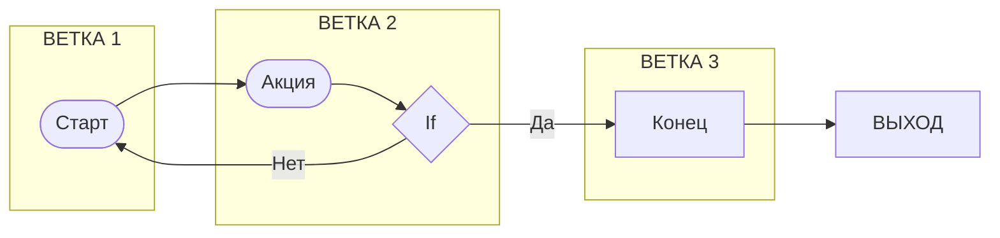
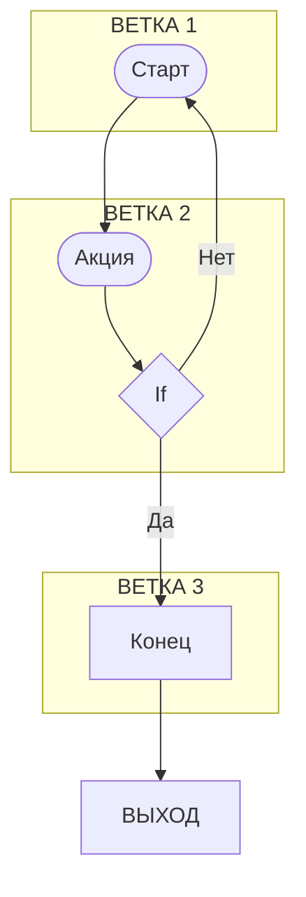

Силуэт ДРАКОН схем Паронджанова наглядно:

+-------+    +-------+              +-------+
|ВЕТКА 1|    |ВЕТКА 2|              |ВЕТКА 3|
+-------+    +-------+              +-------+
    |            |                      |
    v            v                      |
 [Старт]      [Акция]                   |
    |            |                      |
    |            v                      |
    |           / \                     |
    |          /   \                    |
    |          < If >--Нет---           |
    |          \   /        |           |
    |           \ /         |           |
    |            Да         |           |
    |            |          |           |
+-------+    +-------+   +-------+  +-------+
|ВЕТКА 2|    |ВЕТКА 3|   |ВЕТКА 1|  |ВЫХОД  |
+-------+    +-------+   +-------+  +-------+

Mermaid не может отобразить силуэт ДРАКОНа изоморфно.

Ветки горизонтально

Ветки вертикально
