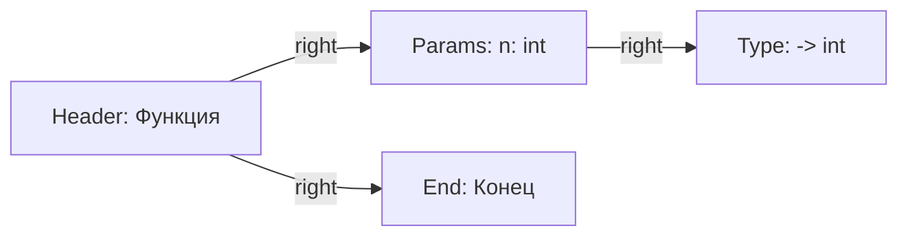

# Техническое задание: Редактор ДРАКОН-схем

## 1. Основные требования

- **Цель:** Создание кроссплатформенного редактора для ДРАКОН-схем Паронджанова.
Путём развития функционала программы [DrakonHub Степана Митькина](https://stepan-mitkin.github.io/drakonhub_desktop/) - в ней отсутствуют и будут добавлены возможности:
- сохранения нескольких функций в одном файле, 
- сворачивание разворачивание участков схемы,
- генерации кода из диаграмм.
- **Особенности:**
  - Визуализация валентных точек для вставки иконок.
  - Возможность перенаправления линий (например, для if).
  - Автоматическая перестройка схемы при изменениях и автосохранение.
  - Поддержка сворачивания/разворачивания блоков.

### 2.1. Базовый функционал

- [ ] Автосохранение в YAML-формате после каждого изменения схемы
- [ ] Автосохранение в YAML-формате.
- [ ] Поддержка нескольких схем функций в одном файле.
- [ ] Переключение между функциями.
- [ ] Вручную иконки не перетаскиваются.
- [ ] Обработка опций командной строки.
--file_open path_to_file - открыть файл
-fo path_to_file - открыть файл
--function_find name - найти функцию по имени и переключиться на нее

### 2.2. Формат данных

```yaml
header: |
  # Произвольный код/комментарии

functions:
  - name: "название_функции"
    params: "типы_параметров"
    return_type: "тип_возврата"
    icons:
      - id: уникальный_идентификатор
        type: "If"
        text: "условие"
        connections:
          right:
            target: id_иконки
            label: "Да"
          left:
            target: id_иконки
            label: "Нет"
          up:
            target: id_иконки_выше
            label: ""
          направление: id_целевого_иконки
    folds:
      - parent: id_родителя
        children: [список_дочерних_узлов]
        collapsed: начальное_состояние
        label: "текст_над_блоком"

footer: |
  # Произвольный код/комментарии
```
YAML нового файла:
```yaml
header: |
functions:
  - name: "reName"
    params: ""
    return_type: ""
    icons:
      - id: 0
        type: "Language"
        text: "Язык"
        connections:
            right:
                target: 1
      - id: 1
        type: "Header"
        text: "reName"
        connections:
            right:
                target: 2
            down:
                target: 4
      - id: 2
        type: "Params"
        text: "n: int"
        connections:
            right:
                target: 3
      - id: 3
        type: "Type"
        text: "-> int"
      - id: 4
        type: "End"
        text: "Конец"
footer: |
```



### 2.3. Поддерживаемые иконки

| Тип иконки   | Форма                    | Линии соединений         | Пример в YAML     |
|--------------|--------------------------|--------------------------|-------------------|
| Язык         | Скруглённый прямоугольник| right                    | `type: "Language"`  |
| Заголовок    | Скруглённый прямоугольник| down, right              | `type: "Header"`  |
| Конец        | Скруглённый прямоугольник| up                       | `type: "End"`     |
| Параметр     | Скруглённый прямоугольник| left, right              | `type: "Params"`  |
| Тип функции  | Скруглённый прямоугольник| left                     | `type: "Type"`    |
| Действие     | Прямоугольник            | up, down                 | `type: "Action"`  |
| Вопрос       | Шестиугольник            | up, left, right          | `type: "If"`      |

## 3. Интерфейс пользователя

- Панель выбора функций.
- Панель инструментов с иконками.
- Область редактирования схемы.
- Масштабирование (Ctrl+колесо мыши).
- Горячие клавиши для основных операций.

## 4. Логика работы

- Автосохранение срабатывает после любого изменения схемы (добавление/удаление иконок, изменение связей, редактирование текста)
- Пользователь не сможет нарисовать не валидную диаграмму ДРАКОН.
- Автовыравнивание элементов.
- Перерасчёт позиций при сворачивании.
- Сохранение состояния блоков.
- Динамическое изменение соединений.
- Визуальная индикация свернутых блоков.

## 5. Пользовательские сценарии (User Stories)

- **Добавление иконки:**  
  Пользователь выбирает иконку (панель или горячая клавиша), программа показывает возможные места вставки. Если клик мимо — режим ожидания.
- **Удаление иконки:**  
  ПКМ по иконке → меню → удалить.
- **Изменение текста иконки:**  
  ПКМ по иконке → меню → изменить текст, либо двойной клик.
- **Сворачивание/разворачивание участка:**  
  Выделение участка → кнопка сворачивания → участок скрывается, появляется плюс. Клик по плюсу — разворачивание.

## 6. Технические требования

- Язык: Python 3.11+
- GUI: PyQt5
- Кроссплатформенность: macOS (приоритет), Windows 10/11
- Ожидаемое количество иконок на одной схеме: до 100 000
- Максимальный размер файла: 1 ГБ

## 7. Прочее

- **Структура кода:**  
  Без классов, иерархия машин состояний, функции двух типов: чистые SRP и управляющие-декораторы.
  Функции называются в стиле объект_метод, как в VBA.
  Не parse_args, а agrs_parse.
- **Обработка ошибок:**  
  Все ошибки должны обрабатываться машинами состояний, отображаться и логироваться.
- **Локализация:**  
  Русский, английский.
- **Внешние сервисы:**  
  Не требуется.
- **Безопасность:**  
  Стандартные требования.
- **Ограничения на запуск кода из header/footer:**  
  Нет.
- **Документация:**  
  Не требуется.

## 8. Открытые вопросы

- Механизм валидации соединений.
- Алгоритм автоматического выравнивания.
- Каждая иконка имеет уникальный ID.

У id указана линия к id 2, а у id 2 указана линия к id 1 ?
```yaml
icons:
  - id: 1
    connections:
      right: 
        target: 2
  - id: 2
    connections:
      left: 
        target: 1  # Обратная связь
```
для такого случая программа должна не запутаться и создать одну линию.

Создай кодом мермейд иерархию машин состояний программы в файл FSM.md